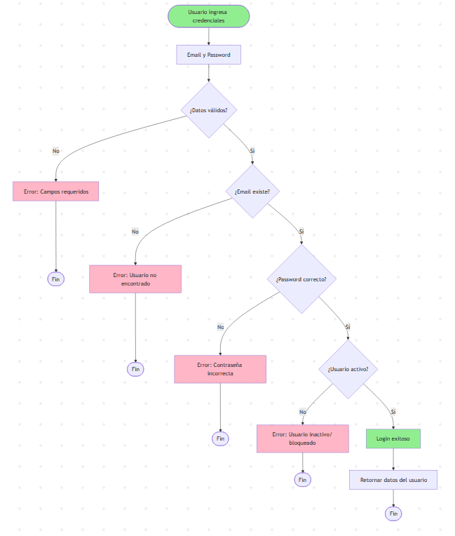

1️⃣ Diagrama de Arquitectura de Microservicios

2️⃣ Diagrama de Base de Datos (Entidad-Relación)

3️⃣ Diagrama de Flujo - Autenticación de Usuario

4️⃣ Diagrama de Flujo - Crear Producto

5️⃣ Diagrama de Componentes - Product-OrderService

6️⃣ Diagrama de Secuencia - Compra de Producto (Futuro)

7️⃣ Diagrama de Estados - Producto

8️⃣ Diagrama de Estados - Usuario/Cliente

